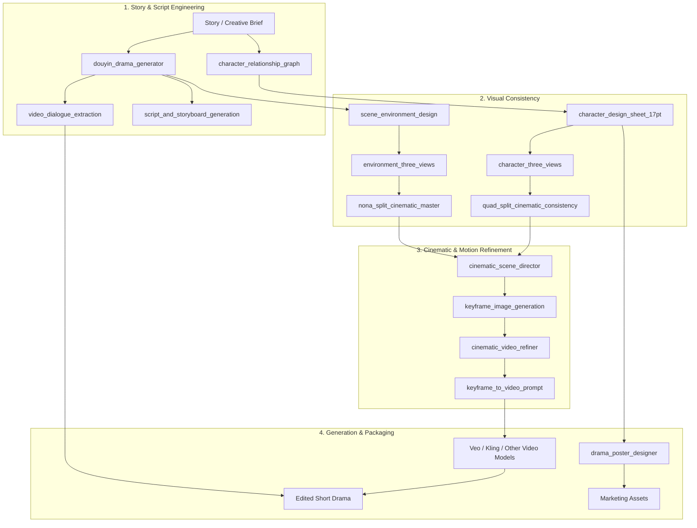

# AI Cinematic Pipeline — 16 Modular Skills for Short-Drama & Video Generation

A modular **AI filmmaking skill library** for turning story ideas into structured short-drama production assets: scripts, character references, scene layouts, cinematic keyframes, motion prompts, video-refinement instructions, and marketing visuals.

The repository is organized around 16 reusable `SKILL.md` modules. Each module encodes a specific production responsibility and a set of hard constraints intended to reduce common AI-video failures such as character drift, broken anatomy, inconsistent environments, weak camera logic, and physically implausible motion.

> 这是一个面向 AI 短剧与影视生成的模块化 Skill 工作流库。重点不是“让一个 Prompt 包办所有事情”，而是把剧本、人物一致性、场景一致性、镜头语言、动作物理和宣发包装拆成可组合、可复用的专业步骤。

**At a glance:** 16 Agent Skills · AI short drama · Character consistency · Environment continuity · Cinematic prompting · Motion repair · Veo / Kling workflows

[16 skills](#the-16-skills) · [Pipeline](#pipeline-overview) · [Consistency strategy](#character-consistency-strategy) · [Targeted repair](#targeted-repair-instead-of-full-regeneration) · [Evaluation boundaries](#evaluation--claim-boundaries)


## What This Repository Is

This repository is best understood as a **cinematic workflow specification + reusable skill library**, not as a video-generation model or a fully autonomous rendering engine.

It structures an AI-assisted production pipeline around four stages:

1. story and script engineering;
2. character and environment consistency;
3. cinematic keyframes and motion refinement;
4. generation, delivery, and marketing assets.

The value of the project is in the **production constraints encoded between stages**: what information must be preserved, what visual anchors must stay stable, what physical or anatomical failures should be prevented, and what each downstream tool needs as structured input.

## Why This Pipeline Exists

AI video workflows often fail for reasons that a single high-level prompt does not solve reliably:

- the same character changes face, hairstyle, accessories, or costume between shots;
- environments shift geometry when the camera angle changes;
- limbs bend unnaturally or objects appear to move without believable force;
- abstract emotion words produce generic or unstable acting;
- camera movement ignores scene geography or character orientation;
- prompt revisions fix one problem but accidentally destroy previously working elements.

This repository addresses those problems by decomposing the workflow into specialized skills with explicit constraints.

## Pipeline Overview



## The 16 Skills

### 1. Story & Script Engineering

| Skill | Responsibility |
| --- | --- |
| `douyin_drama_generator` | Convert a story or outline into high-conflict short-drama beats and physically describable actions |
| `ai_pov_shortdrama_pro` | Build first-person / POV short-drama instructions with bounded micro-expression and camera behavior |
| `video_dialogue_extraction` | Separate character, delivery, and dialogue into structured material for voice/subtitle workflows |
| `character_relationship_graph` | Extract and organize character relationships from complex story material |
| `script_and_storyboard_generation` | Connect script structure, storyboard planning, and downstream production assets |

### 2. Character & Environment Consistency

| Skill | Responsibility |
| --- | --- |
| `character_design_sheet_17pt` | Create a 17-panel character design reference covering body, acting, costume, accessories, and material detail |
| `character_three_views` | Generate consistent front / side / back character references |
| `scene_environment_design` | Establish scene-wide art direction and key environmental details |
| `environment_three_views` | Lock the geometry of a location across multiple viewpoints |
| `quad_split_cinematic_consistency` | Use 2×2 reference layouts to preserve character features across shot types |
| `nona_split_cinematic_master` | Use 3×3 multi-angle reference layouts to anchor complex environments |

### 3. Cinematic & Motion Refinement

| Skill | Responsibility |
| --- | --- |
| `cinematic_scene_director` | Define lens, framing, depth, lighting, composition, and cinematic scene language |
| `keyframe_image_generation` | Turn structured scene direction into cinematic keyframe prompts |
| `cinematic_video_refiner` | Repair motion prompts using physics, anatomy, continuity, orientation, and acting constraints |
| `keyframe_to_video_prompt` | Convert keyframes into bounded camera and motion instructions for video generation |

### 4. Packaging & Marketing

| Skill | Responsibility |
| --- | --- |
| `drama_poster_designer` | Create vertical promotional poster direction from established character and story assets |

## Example: From Abstract Emotion to Model-Readable Action

A recurring design principle is to avoid relying only on abstract emotional adjectives.

Instead of:

```text
She looks devastated and starts crying.
```

A skill may decompose the moment into observable signals:

```text
Lower eyelid gradually fills with moisture.
Breathing becomes shallow.
Eyebrows contract slightly.
A single tear releases only after a blink.
Camera remains stable on an 85mm close-up.
```

The goal is not anatomical complexity for its own sake. The goal is to convert a vague creative instruction into **visual, temporal, and physical constraints** that a generative model can more consistently follow.

## Motion & Physics Constraints

`cinematic_video_refiner` is one of the core examples of this approach. Its protocol library includes constraints for:

- gravity, inertia, contact, and force feedback;
- skeletal and joint continuity;
- staged kinetic chains such as `Prep → Reach → Contact`;
- bounded head/body rotation;
- POV anchoring and anti-clipping;
- camera-axis and left/right orientation consistency;
- object occupancy and seating/position logic;
- environment landmarks and lighting continuity;
- single-contact interaction constraints;
- micro-expression timing and damped acting;
- targeted repair instead of rewriting an entire working prompt.

This makes the skill closer to a **prompt-level QA and repair protocol** than a simple style enhancer.

## Character Consistency Strategy

The pipeline combines several types of reference assets:

```text
Character brief
    ↓
17PT design sheet
    ↓
Front / side / back views
    ↓
2×2 cinematic reference grid
    ↓
Keyframes
    ↓
Video prompts
```

The intent is to preserve a stable set of anchors such as:

- face shape and proportions;
- hairstyle and accessories;
- clothing silhouette and materials;
- recurring props;
- body proportions;
- lighting and scene context.

## Environment Consistency Strategy

A similar approach is used for locations:

```text
Scene definition
    ↓
Environment design
    ↓
Multi-view geometry references
    ↓
3×3 spatial anchor grid
    ↓
Cinematic shot design
```

The prompt system repeatedly references immutable scene anchors so a new camera angle is less likely to regenerate the location as an entirely different space.

## Targeted Repair Instead of Full Regeneration

Several skills are designed around **local repair**.

When an upstream or downstream evaluator reports a specific failure — for example anatomy, temporal continuity, environmental drift, or camera orientation — the preferred response is:

```text
Failure detected
    ↓
Identify failing constraint
    ↓
Preserve working story / composition / assets
    ↓
Patch only the affected instructions
    ↓
Regenerate and compare
```

This avoids the common AI workflow problem where fixing one bad detail causes unrelated parts of the shot to change.

## Supported Generation Tools

The skill outputs are intended to be usable with external image/video generation tools such as:

- Veo;
- Kling;
- other T2I / I2V / T2V systems that accept structured cinematic prompts.

The repository does **not** contain those models and does not imply identical behavior across providers. Each provider may require prompt adaptation and separate evaluation.

## Repository Structure

```text
.
├── skills/
│   ├── douyin_drama_generator/
│   ├── ai_pov_shortdrama_pro/
│   ├── character_design_sheet/
│   ├── character_three_views/
│   ├── character_relationship_graph/
│   ├── scene_environment_design/
│   ├── environment_three_views/
│   ├── quad_split_cinematic_consistency/
│   ├── nona_split_cinematic_master/
│   ├── cinematic_scene_director/
│   ├── keyframe_image_generation/
│   ├── cinematic_video_refiner/
│   ├── keyframe_to_video_prompt/
│   ├── video_dialogue_extraction/
│   ├── drama_poster_designer/
│   └── script_and_storyboard_generation/
└── README.md
```

Each module is documented through a `SKILL.md` file describing its role, goal, workflow, constraints, and expected output behavior.

## Evaluation & Claim Boundaries

This repository contains detailed workflow rules and prompt-engineering constraints, but it does **not currently include a standardized public benchmark** proving universal numerical improvements such as a fixed character-consistency rate or waste-rate reduction across models and projects.

Therefore:

- workflow structure and individual skill rules are repository-verifiable;
- qualitative improvements observed during experiments should be treated as project observations;
- provider-specific success rates should be measured separately;
- any future numerical claim should be tied to a reproducible eval set, model/version, sampling settings, and scoring rubric.

A future evaluation layer should ideally measure:

- character identity consistency;
- costume/accessory persistence;
- environment geometry consistency;
- anatomy and clipping failures;
- motion plausibility;
- camera continuity;
- prompt repair success rate;
- regeneration cost per accepted shot.

## Security & API Key Handling

This repository should never contain real provider credentials.

If a local tool or generation provider requires an API key, keep it in your shell environment or an ignored local `.env` file. The repository ignores `.env*` files (except an optional `.env.example`) and common private-key formats.

Documentation should contain only variable names or placeholders such as:

```bash
PROVIDER_API_KEY="<your-api-key>"
```

Never commit real tokens, private keys, or provider credentials.

## Who This Is For

This repository may be useful to:

- AI filmmakers and short-drama creators;
- creative technologists;
- prompt / context engineers;
- AI-video workflow designers;
- teams building reusable generation pipelines;
- researchers exploring consistency and controllability in generative video workflows.

## Design Principle

The central idea is simple:

> **Do not ask one model prompt to behave like an entire film crew.**

Break the production problem into specialized, inspectable skills; preserve assets and constraints between stages; repair failures locally; and evaluate the generated result instead of assuming a detailed prompt is automatically correct.
