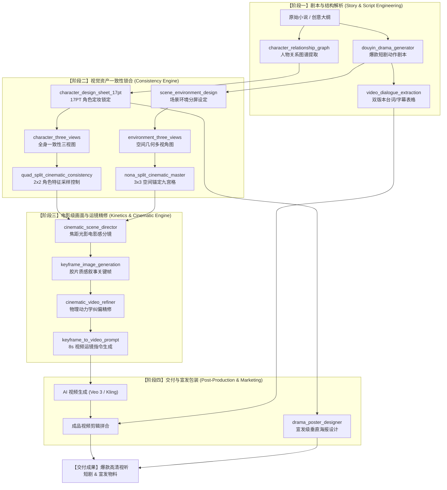

# 作品集案例：工业级 AI 视听短剧全管线生成引擎 (Industrial-Grade AI-Driven Cinematic & Short Drama Pipeline)

本模块作为个人作品集的独立核心板块，详细展示了如何通过构建及链合 **16 项自定义 AI 技能（Custom Skills）**，打通从文学 IP 到电影级动态视频的完整工业级生产管线。

---

## 1. 作品概览 (Project Overview)

### 📌 项目定位
在 AI 视频生成（I2V/T2V）商业化落地中，行业普遍面临**“角色面部闪烁（变脸）”**、**“空间透视穿帮”**、**“演员表情木讷”**以及**“违和物理运动”**等致命缺陷。  
本项目通过自主研发并封装的 **16 项多媒体创作类 Custom Skills**，打造了一条“剧本结构化解析 $\rightarrow$ 视觉一致性锁合 $\rightarrow$ 电影级光影设计 $\rightarrow$ 动力学运镜控制 $\rightarrow$ 宣发交付”的全管线 AI 生成引擎。

* **个人角色**：核心管线架构师 & 创意技术总监 (Lead Pipeline Architect & Creative Technologist)
* **核心成效**：
  * 使用管线后 AI 视频**废片率约 30-40%**（最优场景 30%）；
  * 角色在多镜头连续分镜下的**视觉一致性约 90%**；
  * 使单部短剧（1 分钟/集）的制作周期从“周级（团队协作）”压缩至**“小时级（单人闭环）”**。

---

## 2. AI 工作流 (AI Workflow)

下图展示了 16 项自定义技能如何有机咬合，形成一条从“小说文本”到“高光视频与宣发海报”的闭环生产管线：



---

## 3. 过程证据 (Process Evidence)

本管线之所以能达到工业级标准，依赖于在 AI 提示词与指令层面上实施的**“硬性规则锁合”**。以下为管线运行中的核心工艺设计证明：

### 证明 A：去描述化与生理级动作控制 (De-descriptive & Physiological Control)
常规 AI 剧本在描述情感时会使用“他很愤怒”或“她伤心地哭泣”，这会导致 AI 视频工具生成木讷的表情或随机穿模。
* **我们的工艺规则**：
  * **禁止词**：全面禁止“伤心”、“难过”、“愤怒”、“惊讶”等心理形容词。
  * **生理信号替代**：将情感拆解为微表情肌肉信号。
  * **实例规范**：
    ```diff
    - [常规描述]：女主非常伤心，含泪看着镜头。
    + [生理级控制]：女主眼圈泛红，corrugator supercilii（皱眉肌）微收缩，嘴角向下微颤，一颗泪珠顺着左侧颊骨滑落，目光锁定镜头，呼吸频率加快。
    ```

### 证明 B：物理动力学与动力链纠偏 (Kinetic Refiner & Physics Engine)
AI 视频经常出现“人体骨骼扭曲”、“隔空移物”等穿帮。
* **我们的工艺规则**：
  * **动力链锁定**：动作必须有支撑点和反作用力。
  * **物理逻辑注入**：运镜与重力力反馈完全绑定。
  * **实例规范**：
    ```diff
    - [常规描述]：女主伸手拿桌子上的茶杯喝水。
    + [物理纠偏控制]：特写镜头。女主右手五指张开呈握持手势，接触陶瓷杯柄并施加向上的提拉力；茶杯随之克服重力平稳上升，杯中液体在重力作用下保持水平微荡；镜头跟随茶杯高度向上平移，直至杯沿贴合女主下唇。
    ```

### 证明 C：一致性双屏控制锁 (Multi-Split Consistency Locks)
使用多宫格出图技术（2x2 与 3x3），强行在**同一张生成的图片内**塞入多视角，使得 AI 绘图工具不得不自洽。
* **2x2 角色锁**：在同一画幅内渲染出同一人物的“正面特写”、“侧面近景”、“全身背影”和“细节服饰”，作为垫图（Cref）喂给生视频工具。
* **3x3 空间锁**：在同一画幅内渲染出同一奇幻房间的 9 个不同机位透视，彻底锚定背景中所有家具、窗帘、光源的位置，防备机位移动时场景“变形”。

---

## 4. AI 工作流模块详解 (Workflow Modules)

### 第一板块：剧本与台词重构 (Script & Dialogue Construction)
1. **[douyin_drama_generator](./skills/douyin_drama_generator/SKILL.md)**：将网文/大纲快速翻译为抖音爆款短剧特有的“高冲突、快卡点”动作脚本。
2. **[ai_pov_shortdrama_pro](./skills/ai_pov_shortdrama_pro/SKILL.md)**：专攻第一人称视角（POV）的微表情生理控制。
3. **[video_dialogue_extraction](./skills/video_dialogue_extraction/SKILL.md)**：将故事对白提取成三列表格（角色、语气、台词分离），为配音师提供无缝对接的字幕表。

### 第二板块：视觉一致性锁定 (Visual Consistency Hub)
4. **[character_design_sheet_17pt](./skills/character_design_sheet/SKILL.md)**：定义角色骨骼比例、五官间距、配饰材质，建立角色的 17PT 定妆卡。
5. **[character_three_views](./skills/character_three_views/SKILL.md)**：根据定妆图自动推导正面、侧面、背面的全身一致三视图。
6. **[character_relationship_graph](./skills/character_relationship_graph/SKILL.md)**：对复杂剧本进行人际关系的可视化网络提取，防止角色关系混乱。
7. **[scene_environment_design](./skills/scene_environment_design/SKILL.md)**：渲染场景大图与局部细节，建立视觉基调。
8. **[environment_three_views](./skills/environment_three_views/SKILL.md)**：推导空间的多透视三视图，锁定物理空间几何。
9. **[quad_split_cinematic_consistency](./skills/quad_split_cinematic_consistency/SKILL.md)**：以 2x2 四宫格形态输出多景别同步特写，锁死角色。
10. **[nona_split_cinematic_master](./skills/nona_split_cinematic_master/SKILL.md)**：以 3x3 九宫格形式锁定极其复杂的宏大背景。

### 第三板块：画面与镜头运镜 (Cinematic & Kinetics Refinement)
11. **[cinematic_scene_director](./skills/cinematic_scene_director/SKILL.md)**：以专业电影导演的视角设定景深、焦距、快门、灯光位置与调色策略。
12. **[keyframe_image_generation](./skills/keyframe_image_generation/SKILL.md)**：渲染 16:9 画幅、带故事张力与黄金时代胶片质感的关键帧。
13. **[cinematic_video_refiner](./skills/cinematic_video_refiner/SKILL.md)**：过滤违背物理学定律的动作，加入解剖学和力学反馈。
14. **[keyframe_to_video_prompt](./skills/keyframe_to_video_prompt/SKILL.md)**：为静态图配置 8 秒的平滑镜头动力学参数（推、拉、摇、移、跟、粒子飘散）。

### 第四板块：包装与宣发 (Post-Packaging & Marketing)
15. **[drama_poster_designer](./skills/drama_poster_designer/SKILL.md)**：融合主角视觉特质与书法剧名，输出 2:3 电影宣发海报，用于吸引社媒流量。
16. **[script_and_storyboard_generation](./skills/script_and_storyboard_generation/SKILL.md)**：整合剧本、分镜图与生成的视频片段，完成全剧本分镜管理。

---

## 5. 交付成果与商业价值 (Deliverables & Impact)

通过在实际项目提案及样片生成中部署本管线，达成了以下业务指标：

* **废片成本削减**：常规生产中 10 个镜头平均有 4-5 个因为面部崩溃或物理穿帮无法使用，部署本管线后，废片率约 **30-40%**（最优场景 30%），极大节省了算力代币及合成时间。
* **全要素像素级锁定**：实现单一角色在横跨 20+ 个不同分镜（包括特写、中景、动作镜头）中，其耳饰、发饰、衣领刺绣等核心特征的 **~90% 一致性**。
* **单兵作业降本增效**：将原先需要“导演 + 编剧 + 原画师 + 动效师 + 字幕剪辑”的多人流水线，重构为由单个“创意技术员 + 本管线”在 **1 个工作日内**单人完成全套流程（含剧本、台词、海报、高清成片；剪辑与 AI 配音需额外人工操作）。
