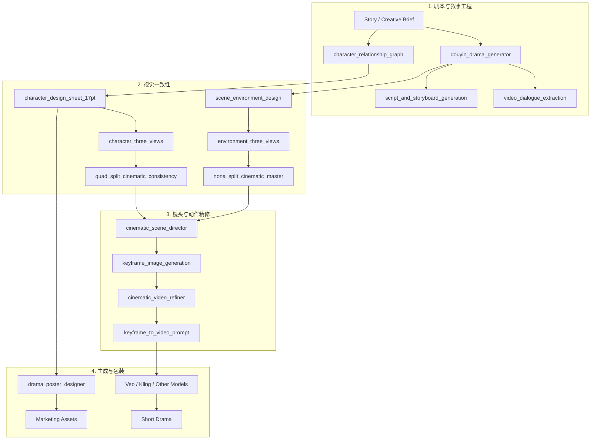

# AI Cinematic Pipeline — 16 个 AI 影视生成 Skills / 16 Modular Skills for Short-Drama & Video Generation

这是一个把短剧与 AI 影视生成拆成 16 个可复用 Skill 的模块化工作流库。

A modular AI filmmaking skill library for short-drama and generative-video workflows.

## 目录 / Table of Contents

### 中文
- [项目简介](#项目简介)
- [为什么做这套 Pipeline](#为什么做这套-pipeline)
- [整体工作流](#整体工作流)
- [16 个 Skills](#16-个-skills)
- [人物一致性策略](#人物一致性策略)
- [场景一致性策略](#场景一致性策略)
- [动作与物理约束](#动作与物理约束)
- [Targeted Repair](#targeted-repair)
- [支持的生成工具](#支持的生成工具)
- [评测与声明边界](#评测与声明边界)

### English
- [Overview](#overview)
- [Why This Pipeline](#why-this-pipeline)
- [Pipeline Overview](#pipeline-overview)
- [The 16 Skills](#the-16-skills)
- [Character Consistency](#character-consistency)
- [Environment Consistency](#environment-consistency)
- [Motion & Physics Constraints](#motion--physics-constraints)
- [Targeted Repair Strategy](#targeted-repair-strategy)
- [Supported Generation Tools](#supported-generation-tools)
- [Evaluation & Claim Boundaries](#evaluation--claim-boundaries)

---

# 中文版

## 项目简介

AI Cinematic Pipeline 是一套面向 AI 短剧与影视生成的模块化 Skill 工作流。

它不是一个视频生成模型，也不是一个已经全自动运行的“工业级影视引擎”。这个仓库真正提供的是：**把剧本、人物、场景、镜头、动作、视频 Prompt 和宣发素材拆成不同职责，并为每个阶段定义可复用约束。**

**关键词：** AI 短剧 · AI 视频 · Agent Skills · 人物一致性 · 场景一致性 · Cinematic Prompting · Motion Repair · Veo · Kling

## 为什么做这套 Pipeline

AI 视频常见失败并不是“Prompt 不够长”，而是一个 Prompt 同时承担太多职责：

- 同一个人物在不同镜头中脸、发型、服装或配饰变化；
- 场景换角度后空间结构发生漂移；
- 肢体关节、接触关系和重力不合理；
- 抽象情绪词无法稳定转成可见表演；
- 运镜忽略人物方向和场景轴线；
- 为了修一个问题重写整段 Prompt，导致已经正确的部分一起变化。

因此这个项目不追求“万能 Prompt”，而是把影视生成拆成更小、更可检查的 Skill。

## 整体工作流


更完整的阶段拆分：



## 16 个 Skills

### 1. 剧本与叙事工程

| Skill | 作用 |
| --- | --- |
| `douyin_drama_generator` | 将故事或大纲拆成高冲突短剧节奏与可描述动作 |
| `ai_pov_shortdrama_pro` | 生成第一人称 / POV 短剧指令，约束微表情和镜头行为 |
| `video_dialogue_extraction` | 提取角色、说话方式和台词，服务配音与字幕流程 |
| `character_relationship_graph` | 抽取复杂故事中的人物关系 |
| `script_and_storyboard_generation` | 连接剧本结构、分镜和后续生成资产 |

### 2. 人物与场景一致性

| Skill | 作用 |
| --- | --- |
| `character_design_sheet_17pt` | 生成覆盖身体、表演、服装、配饰和材质的 17 格人物参考 |
| `character_three_views` | 生成人物正面、侧面、背面参考 |
| `scene_environment_design` | 定义场景整体美术方向与关键环境信息 |
| `environment_three_views` | 锁定同一地点在不同视角下的空间结构 |
| `quad_split_cinematic_consistency` | 使用 2×2 参考布局锁定人物特征 |
| `nona_split_cinematic_master` | 使用 3×3 多角度参考锁定复杂场景 |

### 3. 镜头与动作精修

| Skill | 作用 |
| --- | --- |
| `cinematic_scene_director` | 定义镜头、构图、景深、光线和电影化场景语言 |
| `keyframe_image_generation` | 把结构化场景设计转成关键帧 Prompt |
| `cinematic_video_refiner` | 用物理、解剖、连续性和方向约束修复动作 Prompt |
| `keyframe_to_video_prompt` | 把关键帧转成受约束的运镜与动作指令 |

### 4. 包装与宣发

| Skill | 作用 |
| --- | --- |
| `drama_poster_designer` | 基于已锁定人物和故事资产生成竖版短剧海报方向 |

## 人物一致性策略

```text
Character Brief
    ↓
17PT Design Sheet
    ↓
Front / Side / Back Views
    ↓
2×2 Cinematic Reference Grid
    ↓
Keyframes
    ↓
Video Prompts
```

需要持续保持的锚点包括：

- 脸型和比例；
- 发型和配饰；
- 服装轮廓与材质；
- 固定道具；
- 身体比例；
- 光线和场景语境。

## 场景一致性策略

```text
Scene Definition
    ↓
Environment Design
    ↓
Multi-view Geometry References
    ↓
3×3 Spatial Anchor Grid
    ↓
Cinematic Shot Design
```

通过重复引用不可变的场景锚点，减少“换一个镜头角度就像换了一个地点”的问题。

## 动作与物理约束

`cinematic_video_refiner` 是这套系统中偏“质量修复”的核心 Skill，约束包括：

- 重力、惯性、接触和受力反馈；
- 骨骼和关节连续性；
- `Prep → Reach → Contact` 等动作链；
- 头部和身体旋转边界；
- POV 锚定与穿模控制；
- 左右方向和镜头轴线一致性；
- 物体占位和人物位置逻辑；
- 场景 Landmark 与光线连续性；
- 微表情时序；
- 局部修复而不是整段重写。

## Targeted Repair

```text
发现失败
    ↓
识别具体失败约束
    ↓
保留已经正确的剧情 / 构图 / 资产
    ↓
只修改失败部分
    ↓
重新生成并比较
```

这个策略的目标是避免“修一个问题，其他所有正确部分也跟着漂移”。

## 支持的生成工具

Skill 输出可以继续适配：

- Veo；
- Kling；
- 其他接受结构化 T2I / I2V / T2V Prompt 的生成工具。

仓库本身不包含这些模型，也不假设不同模型会对同一 Prompt 产生相同结果。

## 评测与声明边界

当前仓库已经包含较完整的工作流规则和 Prompt 约束，但**还没有公开、标准化的 Benchmark 可以证明固定的人物一致性提升率、废片率下降比例或跨模型稳定收益。**

因此当前可以验证的是：

- 16 个 Skills 的结构和职责；
- 各 Skill 内的约束规则；
- 人物 / 场景 / 动作的设计方法；
- Targeted Repair 的工作流。

未来更合理的评测指标包括：

- Character Identity Consistency；
- Costume / Accessory Persistence；
- Environment Geometry Consistency；
- Anatomy / Clipping Failure Rate；
- Motion Plausibility；
- Camera Continuity；
- Prompt Repair Success Rate；
- 每个可接受镜头的再生成成本。

---

# English Version

## Overview

AI Cinematic Pipeline is a modular skill library for AI short-drama and generative-video workflows.

It is not a video-generation model or a fully autonomous production engine. The repository provides a reusable workflow specification that separates script, character, environment, cinematography, motion, video prompting, and marketing responsibilities into inspectable skills.

**Keywords:** AI short drama · AI video · Agent Skills · character consistency · environment consistency · cinematic prompting · motion repair · Veo · Kling

## Why This Pipeline

Many AI-video failures are not solved by simply making one prompt longer. A single prompt often carries too many responsibilities at once: character identity, environment geometry, acting, camera logic, anatomy, physics, and continuity.

This repository decomposes those responsibilities into specialized skills with explicit constraints.

## Pipeline Overview


## The 16 Skills

### Story & Script Engineering

| Skill | Responsibility |
| --- | --- |
| `douyin_drama_generator` | Convert stories into high-conflict short-drama beats and describable actions |
| `ai_pov_shortdrama_pro` | Build first-person / POV instructions with bounded acting and camera behavior |
| `video_dialogue_extraction` | Structure character, delivery, and dialogue material |
| `character_relationship_graph` | Extract character relationships from complex stories |
| `script_and_storyboard_generation` | Connect script structure, storyboard planning, and downstream assets |

### Character & Environment Consistency

| Skill | Responsibility |
| --- | --- |
| `character_design_sheet_17pt` | Build a 17-panel character reference |
| `character_three_views` | Generate front / side / back character references |
| `scene_environment_design` | Define scene-wide art direction and environment anchors |
| `environment_three_views` | Lock location geometry across viewpoints |
| `quad_split_cinematic_consistency` | Use 2×2 references to stabilize character features |
| `nona_split_cinematic_master` | Use 3×3 spatial references for complex environments |

### Cinematic & Motion Refinement

| Skill | Responsibility |
| --- | --- |
| `cinematic_scene_director` | Define lens, framing, lighting, depth, and composition |
| `keyframe_image_generation` | Turn scene direction into keyframe prompts |
| `cinematic_video_refiner` | Repair motion prompts with physics, anatomy, continuity, and orientation constraints |
| `keyframe_to_video_prompt` | Convert keyframes into bounded motion and camera instructions |

### Packaging & Marketing

| Skill | Responsibility |
| --- | --- |
| `drama_poster_designer` | Create vertical short-drama poster direction from established assets |

## Character Consistency

```text
Character Brief
    ↓
17PT Design Sheet
    ↓
Front / Side / Back Views
    ↓
2×2 Cinematic Reference Grid
    ↓
Keyframes
    ↓
Video Prompts
```

The pipeline attempts to preserve face shape, hairstyle, accessories, costume silhouette, materials, recurring props, body proportions, lighting, and scene context.

## Environment Consistency

```text
Scene Definition
    ↓
Environment Design
    ↓
Multi-view Geometry References
    ↓
3×3 Spatial Anchor Grid
    ↓
Cinematic Shot Design
```

Repeated spatial anchors are used to reduce geometry drift across camera angles.

## Motion & Physics Constraints

`cinematic_video_refiner` includes rules for gravity, inertia, contact, force feedback, skeletal continuity, staged kinetic chains, bounded rotation, POV anchoring, anti-clipping, screen direction, object occupancy, lighting continuity, micro-expression timing, and local repair.

## Targeted Repair Strategy

```text
Failure detected
    ↓
Identify the failing constraint
    ↓
Preserve working story / composition / assets
    ↓
Patch only the affected instructions
    ↓
Regenerate and compare
```

The goal is to repair one failure without destroying unrelated parts that already work.

## Supported Generation Tools

Outputs are intended to be adapted for tools such as Veo, Kling, and other T2I / I2V / T2V systems that accept structured cinematic prompts.

The repository does not contain those models and does not assume identical behavior across providers.

## Evaluation & Claim Boundaries

The repository contains substantial workflow rules and prompt-engineering constraints, but it does not yet include a standardized public benchmark proving universal numerical gains across models and projects.

Future evaluation should measure character identity consistency, costume persistence, environment geometry, anatomy failures, motion plausibility, camera continuity, repair success rate, and regeneration cost per accepted shot.
